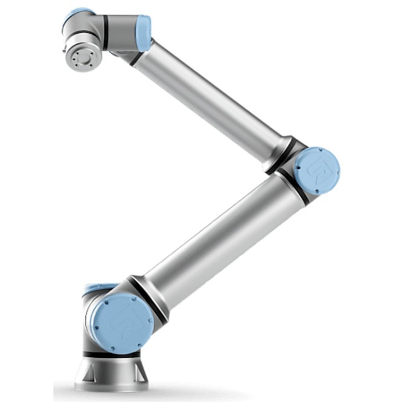
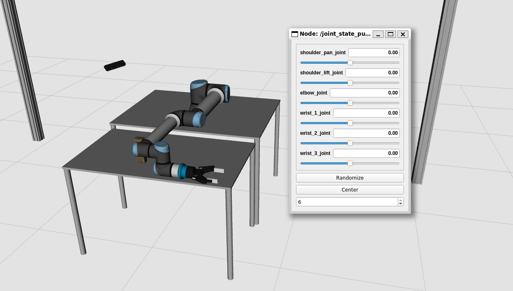
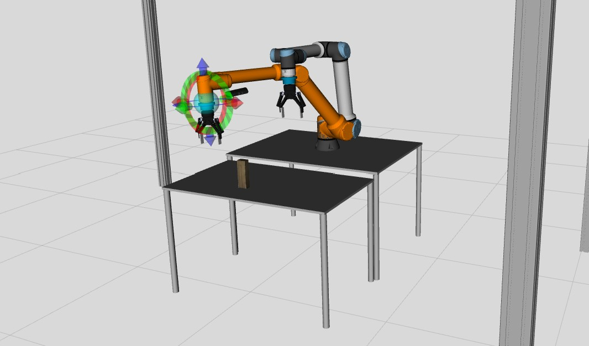

# MecInTouch Workshop Robótica



## Índice

1. [Pre-requisitos](#pre-requisitos)
2. [Instalação](#instalação)
3. [Navegação por comandos em Linux](#navegação-por-comandos-em-linux)
3. [Pôr o UR10e a mexer!](#pôr-o-ur10e-a-mexer)   
3. [Troubleshoot](#troubleshoot)


## Pre-requisitos

1. **Sistema Operativo e Hardware**

SO: Windows 11 (64-bit), qualquer edição.
Memória RAM: Mínimo de 8GB (pode verificar em “Settings > System > About”).

2. **Instalação do PyCharm Community Edition**

Acedam ao link:  https://www.jetbrains.com/pycharm/download/?section=windows  .
Atenção: Façam download somente do "Community Edition" (o instalador .exe para Windows). Evitem o "Professional" que aparece no topo da página.

3. **Ativação do WSL (Windows Subsystem for Linux)**

Sigam as instruções neste tutorial:  https://winsides.com/how-to-enable-windows-subsystem-for-linux-in-windows/#how-to-turn-on-windows-subsystem-for-linux-wsl-in-windows-11-quick-steps  .
Importante: No passo “Turn Windows features on”, certifiquem-se de selecionar as duas opções “Virtual Machine Platform” e “Windows Subsystem for Linux”.

4. **Download do Sistema Operativo Ubuntu**

Abram a Microsoft Store e pesquisem por “Ubuntu 20.04.6 LTS”.
Procedam ao download desse SO. (Não é necessária nenhuma instalação adicional após o download.)

Entrar no Ubuntu (se for a primeira vez, devem definir user e password).


## Instalação
No terminal Ubuntu (Linux), correr cada um dos seguintes commandos, um a um:
```
sudo sh -c 'echo "deb http://packages.ros.org/ros/ubuntu $(lsb_release -sc) main" > /etc/apt/sources.list.d/ros-latest.list'
sudo apt install curl
curl -s https://raw.githubusercontent.com/ros/rosdistro/master/ros.asc | sudo apt-key add -
sudo apt update
sudo apt install ros-noetic-desktop-full
echo "source /opt/ros/noetic/setup.bash" >> ~/.bashrc
source ~/.bashrc
sudo apt install python3-rosdep python3-rosinstall python3-rosinstall-generator python3-wstool build-essential
sudo apt-get install dos2unix
sudo rosdep init
rosdep update
sudo apt install ros-noetic-moveit ros-noetic-industrial-robot-status-interface ros-noetic-scaled-controllers ros-noetic-pass-through-controllers ros-noetic-ur-client-library ros-noetic-ur-msgs ros-noetic-velocity-controllers ros-noetic-force-torque-sensor-controller socat
mkdir -p ~/catkin_ws/src
cd ~/catkin_ws/
catkin_make 
echo "source ~/catkin_ws/devel/setup.bash" >> ~/.bashrc
echo "export LIBGL_ALWAYS_SOFTWARE=1" >> ~/.bashrc 
echo "export LIBGL_ALWAYS_INDIRECT=0" >> ~/.bashrc 
source ~/.bashrc
```
Fechar o terminal Ubuntu (Linux): ``exit``

Re-abrir o terminal Ubuntu (Linux), e correr o comando:
```echo $ROS_PACKAGE_PATH``` que deve retornar o seguinte path:
```/home/[your_user]/catkin_ws/src:/opt/ros/noetic/share``` . 
Se sim, então pode-se executar os seguintes 4 comandos:
```
cd ~/catkin_ws/src
git clone https://github.com/afonsocastro/MecInTouch_workshop.git
cd ~/catkin_ws/
catkin_make
```

## Navegação por comandos em Linux
Para navegar no sistema Linux, sem uma interface gráfica, iremos usar vários comandos do terminal.
Lista dos comandos mais habituais para navegar através do terminal:

| Command                  | Description                                                        |
|--------------------------|--------------------------------------------------------------------|
| Up Arrow                 | Will show your last command                                        |
| Down Arrow               | Will show your next command                                        |
| Tab                      | Will auto-complete your command                                    |
| clear                    | Will clear the screen                                              |
| Ctrl + R                 | Will search for a command                                          |
| exit                     | Will exit the terminal                                             |
| pwd                      | Lists the path to the working directory                            |
| ls                       | List directory contents                                            |
| ls -a                    | List contents including hidden files (Files that begin with a dot) |
| ls -l                    | List contents with more info including permissions (long listing)  |
| cd                       | Change directory to home                                           |
| cd [dirname]             | Change directory to specific directory                             |
| cd ~                     | Change to home directory                                           |
| cd ..                    | Change to parent directory                                         | 
| history                  | Lists all the commands history                                     |
| ![cmd_num]               | Execute the command number [cmd_num] listed in *history*           |
| python3 [name_file].py   | Execute the python3 script                                         |


## Pôr o UR10e a mexer!
### 1. Lançar o RViz para controlar as 6 juntas do Manipulador, através da interface:


````
roslaunch scripts rviz_larcc.launch
````

Para melhor entendermos todo o sistema, devemos saber que o RViz é o controlador do robô (atuador nos motores elétricos das várias juntas, que o fazem mexer). 

**RViz = Controlador das Juntas**



### 2. Lançar Gazebo para simular o mundo real, c/ RViz a controlar

[//]: # (![tp3]&#40;docs/gazebo-and-ros-687x319.jpg&#41;)

Se o passo anterior funcionou sem problemas, está na altura de testarmos num ambiente simulado:


````
roslaunch scripts spawn_ur10e_eff_controller.launch
````
Este comando lança o Gazebo. O Gazebo é o simulador do mundo real, isto é, não controla o robô: sofre das alterações que podem ser provocadas atrás do RViz.

**Gazebo = simulador do mundo real**

Após lançar, é necessário dar-mos 'Play' ao Gazebo world, para que o RViz surja e nos permita controlar o robô.
É possível controlar o robô de duas formas: 
*MotionPlanning > Joints* ou Arrastando diretamente (usando o rato) o marcador interativo presente no pulso do robô. 
Após escolher a sua pose "destino" (a laranja), podemos mandar o manipulador planear a trajetória e executá-la:
*MotionPlanning > Planning > Plan & Execute*.



### 3. Substituir o RViz pelo nosso próprio controlo personalizado
Chegou o momento de colocarem mãos à obra!
O objetivo da primeira tarefa de hoje é criarem um script em Python, para controlar o manipulador UR10e, substituindo assim o RViz.
Para tal, têm um exemplo de rascunho em ```scripts/src/example.py```.
O melhor será criarem um novo ficheiro, com um nome que vos identifque enquanto grupo de trabalho.


Devem usar as funções que estão disponíveis para comandar o robô, bem como a sua garra.
Podem fazer o que quiserem: 
- fazer o robô andar em ciclos repetitivos sem fim;
- deslocar-se até uma posição acima de um objeto para depois baixar e o apanhar;
- fazer o robô dançar;
- fazer o robô lançar alguma peça;
- etc

Para tal, deverão usar o que sabem já de programação em python: condições if, ciclos while ou for, tudo está ao vosso dispôr.
Dica: se quiserem saber valores de juntas de uma determinada posição, podem lançar os 2 comandos anteriores (passos 1 e/ou 2) que abrem o rviz e vos permitem explorar à vontade!

Para irem testando como está o processo do vosso script, basta lançarem o Gazebo:
````
roslaunch scripts spawn_ur10e_eff_controller.launch open_rviz:=false
````
Dar play ao Gazebo, e, num novo terminal:
````
rosrun scripts [file_name].py
````

### 4. Testar no Robô Real

Quando o vosso script da tarefa anterior estiver pronto (e funcional), poderão dar upload do mesmo para a seguinte pasta:
https://drive.google.com/drive/folders/13MzDoU4itSrZIgErhY2RknKAz8FXpnGy?usp=drive_link

Vamos testá-lo no robô real!

Nota: devem procurar pelo vosso script em ```Linux/Ubuntu_20.04/home/[user_name]/catkin_ws/src/MecInTouch_workshop/scripts/src```
## Troubleshoot
Cada novo script python criado deve conter SEMPRE, na sua primeira linha: ```#!/usr/bin/env python3```. 
Para além disso, antes de poder ser executado (principalmente quando se inicializa um novo ROS Node), necessita das 2 seguintes permissões:

```
chmod 777 [file_name].py
dos2unix [file_name].py
```
Após estes 2 comandos, já se pode lançar o novo ROS Node (python script):

```
rosrun [package_name] [file_name].py
```